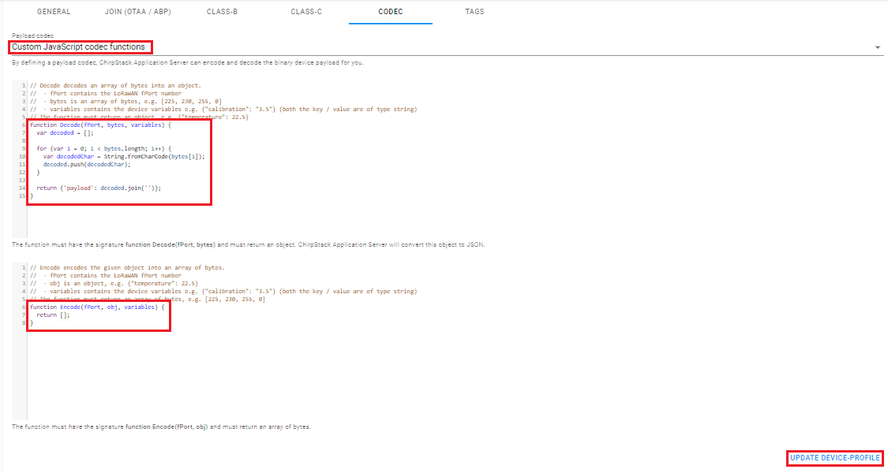

# LoRa Server

Helps to create a docker image of a LoRa Server based on [ChirpStack](https://www.chirpstack.io/) using the Semtech protocol and the band frequency of AU915

## 💻 Project

#### Building Project


#### Build Done


#### Starting and Checkink the Server


## 🚀 Technologies

 Python3.7+

 Docker

 Docker Compose

## 🏃 Usage

Before you start the server theres some commands that you have to run, just copy and paste one by one the commands bellow:

``` 

git clone https://github.com/douglasJovenil/lora-server
cd lora-server/container
docker-compose build
```

Now to run:

``` 

docker-compose up -d
```

**IMPORTANT**: remember to open the port **1700/udp** and **8080/tcp** on your **firewall**.

## ⚙️ Setup

Access the address **localhost:8080** on your web browser


Insert the following credentials:

* **user**: admin
* **password**: admin

If there are no problems, you will be redirect to dashboard


### Creating a Network Server

Click on **Network-server** then **ADD**


On this screen we have to fill the fields

* **Network-server name**: any name that you will use to identify the server
* **Network-server host**: the address of the machine that is running the chirpstack-network-server application, in this case this application is on same machine of chirpstack-application-server so we can just use **127.0.0.1:8000** 

With this field filled just click on **ADD NETWORK SERVER**


### Creating a Service Profile

Click on **Service-profiles** then **CREATE**


On this screen we have to fill:

* **Service-profile name**: any name that you will use to identify this service
* **Network-server**: the LoRa server that we created on previous step
* **Maximum allowed data rate**: This field we set to **5**, this value respect the Semtech protocol

And check the field:

* **Add gateway meta-data**: adds information of gateway to the package

Then click on **CREATE SERVICE-PROFILE**


### Creating a Device Profile

Click on **Device-profiles** then **CREATE**


We will have to fill:

* **Device-profile name**: any name that you will use to identify this type of device
* **Network-server**: the LoRa server that we created on the first step
* **LoRaWAN MAC version**: if you will follow this documentation, just use 1.0.2
* **LoRaWAN Regional Parameters revision**: type of your LoRa device.
* **Uplink interval (seconds)**: interval between uplinks

Then click on **JOIN (OTAA/ABP)**


Check the box **Device support OTAA** then click on **CODEC**


Select **Custom JavaScript codec functions**, with this you can just write any function that you desire to encode e decode your packages. After you write your functions, click on **CREATE DEVICE-PROFILE**



### Creating a Gateway

Click on **Gateways** then **CREATE**


On this screen fill the fields:

* **Gateway name**: any name that you will use to identify this gateway
* **Gateway description**: any description to specify this gateway
* **Gateway ID**: MAC address of your gateway
* **Networkserver**: the LoRa server that you created on first step
* **Gateway altitude (meters)**: any value, this will be update on first uplink
* **Gateway location**: local where your gateways is

Then click on **CREATE GATEWAY**


### Creating an Application

Click on **Applications** then **CREATE**


On this screen fill the fields:

* **Application name**: any name that you will use to identify this application
* **Application description**: any description to specify this application
* **Service-profile**: service that you created previously

then click on **CREATE APPLICATION**


### Creating a Device

Select the application that you created on previous step


Then **CREATE**


On this screen fill the fields:

* **Device name**: any name that you will use to identify this device
* **Device description**: any description to specify this device
* **Device-profile**: profile that you created previously

The field **Device EUI** select **LSB** and click on **refresh** icon to generate a Device EUI.

Check the following fields:

* **Disable frame-counter validation**: only when you are testing the device


Now select the device


Click on **Keys (OTAA)**, click on both **refresh icons** to create **Application key** and **Gen Application Key** then **SET DEVICE-KEYS**. You will use this keys to setup your hardware.


