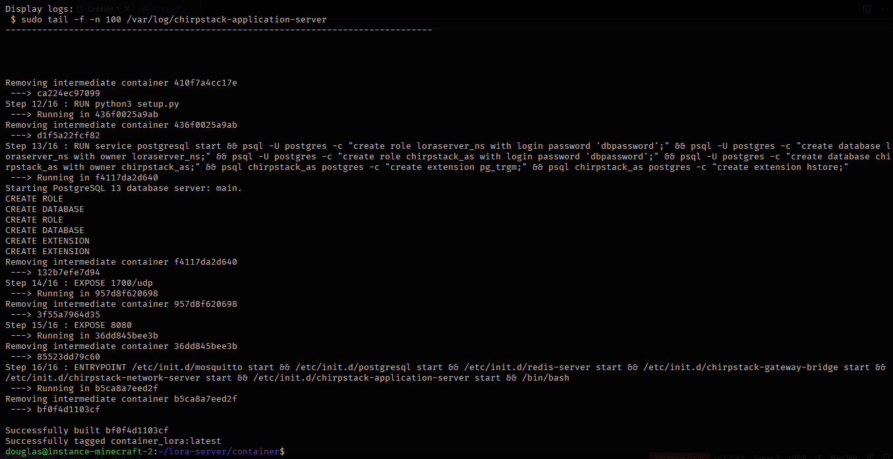

# LoRa Server

Helps to create a docker image of a LoRa Server based on [ChirpStack](https://www.chirpstack.io/)

## 💻 Project

#### Building Project


#### Build Done



#### Start and Check Server


## 🚀 Technologies

 Python3.7+

 Docker

 Docker Compose

## 🏃 Usage

Before you start the server theres some commands that you have to run, just copy and paste one by one the commands bellow:

``` 

git clone https://github.com/douglasJovenil/lora-server
cd lora-server/container
docker-compose build
```

Now to run:

``` 

docker-compose up -d
```

**IMPORTANT**: remember to open the port **1700/udp** and **8080/tcp** on your **firewall**.

## ⚙️ Setup

Access the address **localhost:8080**


Insert the following credentials:

* **user**: admin
* **password**: admin

If there are no problems, you will be redirect to dashboard


